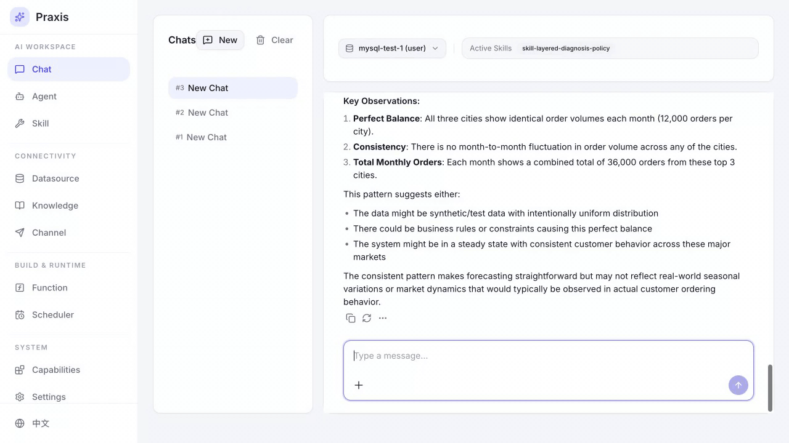
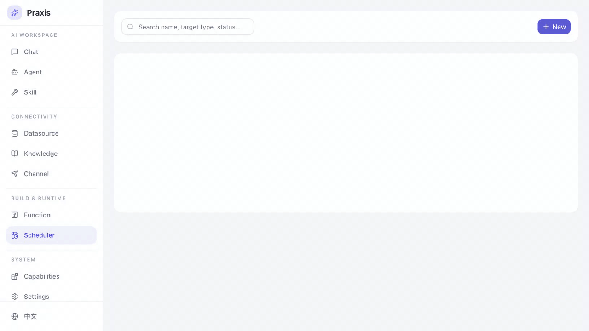

<p align="center">
  
</p>

<p align="center">
  <b>AI 原生数据库 Agent 平台。</b><br>
  把你的数据库变成自治的 AI 工作空间——对话、分析、自动化，全部用自然语言完成。
</p>

<p align="center">
  <a href="https://github.com/sunetic/praxis/blob/main/LICENSE"></a>
  
  
  
  
</p>

<p align="center">
  <a href="README.md">English</a> | <a href="README_CN.md">中文</a>
</p>

---

## Praxis 是什么

Praxis 是一个可自部署的平台，把你的数据库变成 AI 对话工作空间。不用手写 SQL，用自然语言描述你的需求——Praxis Agent 理解你的表结构，自动编写和执行查询、分析结果，还能调度定时任务。支持任意 **OpenAI 兼容**的模型提供商，开箱支持 **MySQL** 和 **PostgreSQL**。

## 看看效果

### 诊断你的数据库

让 Agent 执行一次健康检查。它会自主检查表大小、索引使用情况和存储指标——执行多步诊断查询，并给出可操作的建议，就像一个 DBA 一样。

<p align="center"></p>

### 保存和运行 Agent

当一段诊断流程效果不错，一句话保存为可复用的 **Agent**。Agent 会记住整个多步分析过程——随时运行，用最新数据对任意数据源重复同样的检查。

<p align="center"></p>

### 调度自动化

配置任意 Agent 按计划定时执行——每日健康检查、每周索引审查、定期性能审计。Praxis 自动运行并保存结果。

<p align="center"></p>

## 快速开始

```bash
docker run -d -p 8000:8000 -v ~/.praxis/data:/app/data sunzy2/praxis:latest
```

打开 [http://localhost:8000](http://localhost:8000)，按引导向导连接你的第一个数据库并配置 AI 提供商。

## 更多功能

- **可插拔技能** — Markdown 格式的提示词模块，赋予 Agent 领域专业能力（如分层诊断策略、慢查询分析）。用 YAML Front Matter 编写，无需写代码。
- **知识库** — 上传文档构建知识库。Agent 对话时可引用知识库内容，提供更精准、有依据的回答。
- **函数** — 定义基于 SQL 模板的可复用数据查询函数，可视化构建和测试，然后提供给 Agent 使用或调度自动执行。
- **渠道** — 对接外部消息平台（Slack、钉钉等），让用户在 Praxis 界面之外也能与 Agent 交互。

## 架构

```
┌─────────────────────────────────────────────────────────┐
│                      Praxis UI                          │
│                  (React + TypeScript)                    │
└──────────────────────┬──────────────────────────────────┘
                       │ REST API
┌──────────────────────▼──────────────────────────────────┐
│                  Praxis Backend                         │
│               (FastAPI + Python 3.11+)                  │
│                                                         │
│  ┌──────────┐ ┌──────────┐ ┌───────────┐ ┌───────────┐ │
│  │  Agents  │ │  Skills  │ │ Functions │ │ Scheduler │ │
│  └────┬─────┘ └────┬─────┘ └─────┬─────┘ └─────┬─────┘ │
│       └─────┬──────┴─────────────┘              │       │
│             ▼                                   │       │
│  ┌───────────────────┐  ┌────────────────────┐  │       │
│  │   LLM Provider    │  │    Datasources     │◄─┘       │
│  │ (OpenAI-compat.)  │  │  MySQL/PostgreSQL  │          │
│  └───────────────────┘  └────────────────────┘          │
└─────────────────────────────────────────────────────────┘
```

## 本地开发

### 前置要求

- Python 3.11+
- Node.js 18+
- [uv](https://github.com/astral-sh/uv)（Python 包管理器）

### 后端

```bash
make install       # 安装依赖 (uv sync)
make migrate       # 执行数据库迁移
make dev           # 启动 API 服务 :8000，热重载
```

### 前端

```bash
cd frontend
npm install
npm run dev        # Vite 开发服务 :5173
```

### Docker 构建

```bash
make docker-build  # 构建 praxis:latest
```

### 运行测试

```bash
make test          # 运行 pytest
make lint          # 运行 ruff + semantic guard
```

## 路线图

- [ ] 更多数据库支持（Oracle、SQL Server、ClickHouse……）
- [ ] 内置仪表盘与可视化
- [ ] 多用户与 RBAC
- [ ] 社区技能市场
- [ ] MCP（Model Context Protocol）集成

## 参与贡献

欢迎任何形式的贡献！无论是 Bug 报告、功能建议还是 Pull Request。

1. Fork 本仓库
2. 创建功能分支 (`git checkout -b feature/amazing-feature`)
3. 提交更改 (`git commit -m 'Add amazing feature'`)
4. 推送到分支 (`git push origin feature/amazing-feature`)
5. 创建 Pull Request

## 社区

- [GitHub Issues](https://github.com/sunetic/praxis/issues) — Bug 报告与功能建议
- [GitHub Discussions](https://github.com/sunetic/praxis/discussions) — 提问与交流

## 许可证

Praxis 社区版开源发布，详见 [LICENSE](LICENSE)。
