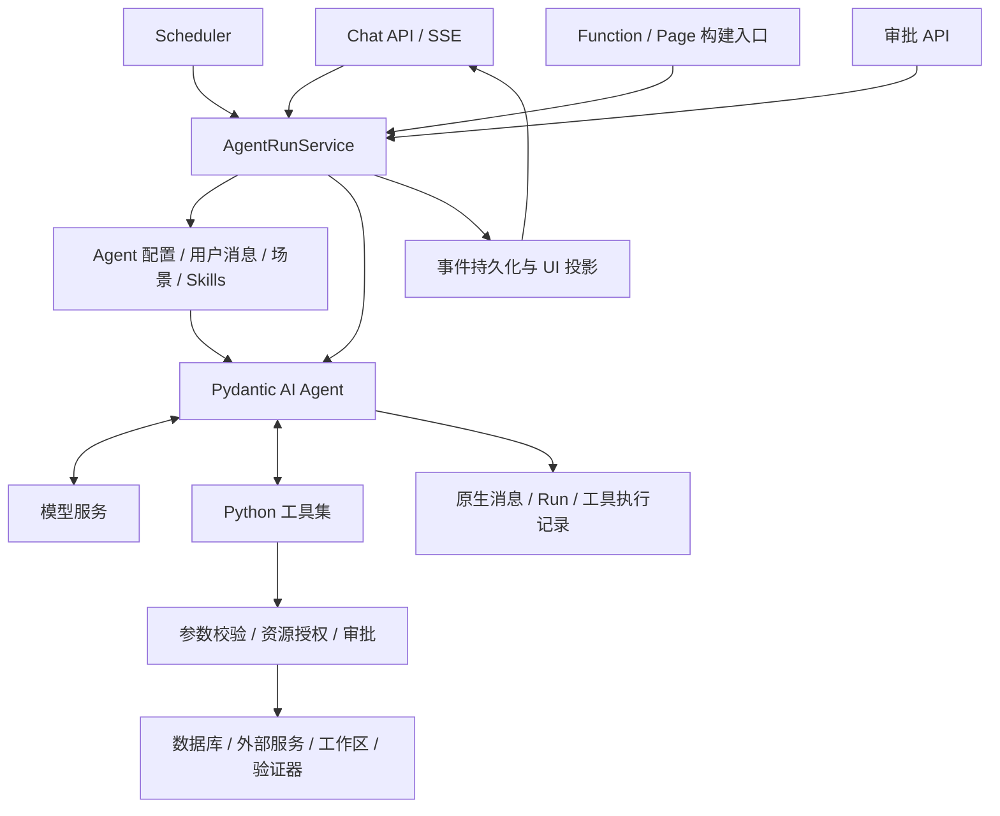

# Agent 运行时重构方案

Praxis 采用 Pydantic AI 的标准 Agent 执行循环。模型根据用户目标和工具结果决定下一步；平台负责提供工具、执行权限、保存会话、暂停与恢复。删除自研任务语义状态机，以及围绕它形成的反思、完成修复和外层构建重试机制。

本次按全新架构实施。数据库、API、前端事件和测试同步调整；不保留旧运行时、旧协议兼容层、数据迁移适配或运行时切换开关。数据库连接、业务对象操作、工作区文件操作和验证器中的有效实现继续复用。

当前交付先完成普通 Chat 主流程，包括原生消息历史、上下文、工具调用、数据库写入审批、暂停恢复、流式事件和浏览器展示。Function 和 Page 暂不纳入本轮交付与验收；后文相关设计留作恢复建设时使用。已有实现可以保留，但不能为它们恢复旧 Agent 循环，也不能用未完成的 Function 或 Page 阻塞 Chat 收尾。

## Chat 体验目标

用户应当能通过连续对话完成工作：简单问题直接得到回答，复杂任务由 Agent 根据实际结果推进，需要用户决定时清楚地提问，结束时交代结果和限制。接入 Pydantic AI 只解决执行内核问题；智能、自然和流畅仍是产品体验目标，但基础模型自身的准确率和幻觉不由本次 Runtime 重构解决。

体验评测仍检查目标理解、上下文利用、工具选择、表达分寸和对话连续性，用于判断模型配置是否适合产品。Runtime 的验收检查平台是否把完整历史、工具事实和最新要求按正确顺序交给模型，以及界面是否准确呈现原始结果。确认链路正确后，模型仍然答错或未能自我纠正，记录为模型评测结果，不通过提示词补丁、答案改写或额外裁判循环掩盖。流畅性中的界面响应单独测量模型等待、工具耗时、事件传输和浏览器渲染。

| 场景 | 用户应当得到的体验 | 不接受的表现 |
| --- | --- | --- |
| 简单问答、解释已有结果 | 直接回答，详略跟随问题和用户要求 | 先输出计划、调用无关工具，再重复问题 |
| 多步查询、诊断或构建 | 自主处理已获授权的步骤，在有用时简短说明发现或调整 | 每做一步都要求“继续”，或逐条朗读工具日志 |
| 工具失败但存在可行路径 | 利用具体错误修正做法，保留真实失败事实 | 把第一次失败当作整项任务失败，反复道歉或复述同一计划 |
| 信息不完整 | 可安全确定的部分先处理；影响正确性、操作目标或授权的缺口集中询问 | 问已经回答过的问题，或擅自猜测写入目标 |
| 批准、拒绝或修改要求 | 承接已有结果继续处理；明确区分拒绝某动作与取消整个任务 | 批准后忘记目标，拒绝后重复弹同一张卡，修改后继续旧动作 |
| 长任务、长对话 | 保留最新约束，能看出正在等待什么，允许停止或追加输入 | 长时间界面无反馈、压缩后失忆、把连接心跳当成工作进展 |
| 正常结束、受限或无法完成 | 结论清楚；能区分已执行、推断、未验证和需要用户处理的部分 | 用“已完成”掩盖失败、未发布或没有执行的检查 |

这些是场景期望，不是要求运行时先分类再走不同流程。同一个主 Agent 根据当前上下文决定回答、使用工具或提问。必要的澄清和审批不因追求“少打断”而省略，简短回答也不因追求“有过程”而被强迫扩写。

## 技术选型与适用范围

### 采用 Pydantic AI 的 Agent 内核

Pydantic AI 适合当前项目，主要依据是执行能力和接入方式。

1. Python 原生，可以在现有 FastAPI 服务内直接调用现有异步工具。无需新增 Node 服务、跨语言 RPC 或工具代理进程。
2. 原生支持工具调用、普通文本输出、流式事件、消息历史以及延迟工具。审批可以成为一个暂停的工具调用，批准后继续处理它的结果。
3. 可以使用自定义 OpenAI-compatible endpoint，符合 Praxis 当前 `ai_base_url`、`ai_model`、`ai_api_key` 的配置方式。
4. 可分别处理参数修正和业务执行失败。普通业务失败可以成为模型可见的工具结果，模型继续选择策略。

上述能力分别见官方 [Agent 文档](https://ai.pydantic.dev/agents/)、[延迟工具文档](https://ai.pydantic.dev/deferred-tools/)、[模型适配文档](https://ai.pydantic.dev/models/openai/)。这说明接口能够承载需求，尚不代表已在 Praxis 的真实模型端点上完成验证。

采用 `pydantic-ai-slim[openai]`，以已发布的 **2.43.0** 为首轮验证基线。实施时锁定该版本及传递依赖，以对应版本源码确认 API；升级作为单独变更处理。该版本发布信息及源码可在 [PyPI](https://pypi.org/project/pydantic-ai-slim/2.43.0/) 和 [v2.43.0](https://github.com/pydantic/pydantic-ai/tree/v2.43.0) 核对。

仅使用本次所需的 Agent、工具、模型适配、消息、事件及公开扩展接口。暂不引入独立工作流平台、自动多 Agent 团队、在线任务裁判或框架提供的其他可选能力。Pydantic AI 内部如何实现循环由上游维护，Praxis 不再编排自己的 planning/reflecting/responding 图。

### 其他方案的取舍

| 方案 | 适配情况 | 决定 |
| --- | --- | --- |
| Pydantic AI 标准 Agent | Python 原生；支持工具、流式事件和审批恢复 | 采用 |
| pi | 核心循环和会话分层可供参考；实现为 TypeScript | 保留为设计参照，不引入依赖 |
| 继续精简 ReasoningEngine | 仍由 Praxis 维护循环、模型协议、恢复及终止行为 | 删除该实现，不继续演化 |
| 自建工作流图 | 需要重新决定阶段、边和任务状态，增加第二套决策逻辑 | 不采用 |

### 同步替换模型调用层

当前仓库 HEAD 为 `7000197`。锁文件中的 LiteLLM 1.85.0 依赖 `openai>=2.20,<3`；Pydantic AI 2.43.0 的 OpenAI extra 要求 `openai>=3.8`，两者存在明确冲突。当前 Pydantic 2.12.5 则满足其 `pydantic>=2.12` 要求。依据包括项目 `uv.lock`、[LiteLLM 发行元数据](https://pypi.org/pypi/litellm/1.85.0/json) 和 [Pydantic AI 发行配置](https://github.com/pydantic/pydantic-ai/blob/v2.43.0/pydantic_ai_slim/pyproject.toml)。

最终代码移除 LiteLLM。一个模型工厂读取平台配置，生成 Pydantic AI 模型对象和请求设置。需要 Agent 能力的调用统一使用 Agent；标题生成、摘要、一次性分类等调用采用官方 direct model request 接口。它们共享模型配置与观测，不再通过旧 `LLMClient.chat()` 模拟另一种响应格式。参见 [Direct Model Requests](https://ai.pydantic.dev/direct/)。

现有 `app/services/llm.py` 的配置读取、密钥管理和遥测能力拆入模型工厂；旧响应字典适配、LiteLLM 异常适配和静默移除参数重试逻辑删除。模型明确不支持某参数时，由已验证的 provider profile 决定请求设置；配置错误应可见。

Dockerfile、Compose、锁文件和对应测试一并移除 LiteLLM wheel 的专用构建逻辑。后端运行环境仍为 Python，不新增运行进程或远程 Agent 服务，也不要求使用 Logfire 云服务。

### 模型能力与对话质量

模型选型与内核选型分别验证。当前模型端点在真实工具和上下文上测试指令理解、多轮承接、工具纠错、中文表达、流式输出和延迟。模型样本用于呈现实际体验和支持后续选型，不作为 Runtime 重构是否正确的替代判据。

记录模型版本、endpoint 配置、上下文窗口、输出预算，以及实际支持的采样和推理参数。先固定一套经过评测的 Chat 配置，不引入根据用户句意自动切换快慢模型的路由。参数变化作为独立评测变量，不能通过隐藏切换模型掩盖质量或延迟问题。评测报告仅记录脱敏配置，不保存 API key 等凭据。

模型不能稳定处理某类任务时，先对照最小工具 harness 与产品路径，区分模型能力、上下文、工具反馈和事件展示问题。上下文缺失、工具事实失真或事件展示错误由 Runtime 修复；完整输入下仍然出现的推理错误归入模型评测。不能通过补回任务状态机修复模型能力不足，也不在主 Agent 回答之后增加一个“拟人化改写 Agent”。最终回答由处理任务、掌握执行证据的主 Agent 直接生成。

## 架构必须满足的约束

这些约束用于实施和代码评审，任何一项被破坏都意味着方案没有落地。

- **同一用户目标的下一步由一个主 Agent 决定。** 工具执行失败、验证失败和新的事实回到它的消息历史。
- **普通 Agent 可以自然结束。** 不强制完成工具、最终 JSON、计划对象、任务契约或逐工具规划元数据。
- **工具边界在服务端真实执行。** 传给模型的工具集合与执行端允许的工具集合一致；资源授权仍在每次执行时检查。
- **运行状态只描述执行事实。** 不用摘要签名、失败次数或自研分数判断任务是否有进展、用户目标是否满足。
- **暂停与恢复使用原始消息和工具调用身份。** 不再依赖另一份“权威任务 journal”解释发生过什么。
- **产物验证约束发布行为。** 验证器返回事实，发布服务检查版本及验证记录；验证器不启动另一个 Agent 循环。
- **对话体验不引入第二套控制循环。** 不强制进度播报，不按自然语言内容切分执行阶段，不增加逐轮表达评分、完成裁判或回答润色调用。

LLM 驱动允许模型选择错误、调整策略或过早结束。此类质量问题通过模型能力、工具设计、必要上下文和结果评测解决。平台不再用控制工具或语义计数器把模型强行推入预设流程。

## 系统组成



`AgentRunService` 是应用服务，负责创建运行、装配依赖、调用框架、保存消息、处理取消和恢复。它不生成计划，不解释失败的业务含义，也不在模型回答后再发起“看看是否完成”的调用。

Agent 实例按运行创建；可共享无状态工具定义和模型连接池。当前用户、会话、数据源、工作区、授权和预算放进 run-scoped dependencies，避免现有共享 ChatService 上的可变字段泄漏到其他会话。

SQLAlchemy Session 不跨并行工具共享。每次数据库操作取得自己的短生命周期 session；运行依赖保存 session factory 与不可变标识。

### 入口统一

| 入口 | 提供给运行服务的内容 | 结果消费方式 |
| --- | --- | --- |
| 普通 Chat / 自定义 Agent | 用户输入、Agent 配置、会话及数据源 | 订阅同一套事件，显示模型回答及工具卡片 |
| Scheduler | 调度指令、Agent 配置、身份及执行策略 | 保存输出与实际运行状态；无需绕经内部 HTTP/SSE |
| Function 构建 | 用户要求、Function 工作区、运行契约、工具集合 | 读取文件差异、验证记录和模型回答 |
| Page 构建（后续范围） | 用户要求、Page 工作区、依赖资源、工具集合 | 读取页面产物、绑定记录、验证记录和模型回答 |

场景通过配置、工具和上下文表达。移除 `FunctionChatAgent`、`PageChatAgent` 为了继承 Chat 而形成的调用链，以及 `inspect.signature` 参数兼容分支。

一次 Page 构建需要新建 Function 时，在同一主运行中提供经过授权的 Function 工作区及工具。模型可以创建依赖、验证依赖，再继续页面工作。平台不固定执行“需求分析→需求精化→实现→外层反思”几个阶段。

知识检索提供 search/read 等工具，返回来源、版本与片段。默认不再藏一个使用 ReasoningEngine 的检索 Agent。已有显式 Agent 委托能力如果保留，也使用同一运行服务创建有独立任务边界的子运行，共享父级资源预算；子运行不负责判定父任务是否完成。本次不新增自动委托机制。

## 主循环与停止行为

每次正常执行调用一次框架 Agent，由框架完成其内部循环：模型返回工具调用时执行工具并回填结果；返回最终文本时结束。应用代码只消费事件和结果。

默认输出类型为 `str`；可能出现审批的 Agent 使用 `str | DeferredToolRequests`。`DeferredToolRequests` 是工具暂停结果，不是要求模型生成的完成协议。

流式接入使用官方 `run(event_stream_handler=...)`，由服务把事件持久化并发给订阅者。也可在实现中用其 `run_stream_events()` 包装，但整个项目只保留一种入口。不能以收到第一段文本作为最终结果；官方文档区分了 `run_stream()` 的最终结果选择与完整事件执行方式。[流式执行说明](https://ai.pydantic.dev/agents/#streaming-all-events)

普通文字与工具调用同时出现时，工具仍需执行。采用 2.43.0 的 `graceful` 结束策略并明确覆盖这个测试；不使用结构化 output tool 作为所有 Agent 的最终出口。对应行为见 [版本化执行源码](https://github.com/pydantic/pydantic-ai/blob/v2.43.0/pydantic_ai_slim/pydantic_ai/_agent_graph.py)。

允许应用层结束或暂停的原因限定为：

| 原因 | 处理 |
| --- | --- |
| 模型正常结束 | 保存最终消息，标记本次运行 finished |
| 工具需要批准 | 持久化当前原生历史及待批动作，标记 waiting_approval |
| 用户取消 | 传播取消信号，记录已完成操作及无法取消的操作 |
| 明确的请求数、费用或执行时长预算耗尽 | 标记 limited，说明具体限制，保留真实结果 |
| 模型服务/运行基础设施无法继续 | 标记 failed 或 interrupted，并记录可恢复位置 |

未知列、文件不存在、构建失败、权限拒绝等工具结果不直接终止整项任务。执行端拒绝越权动作后，模型仍可以寻找其他已授权路径。

同一调用参数重复也不自动终止：轮询和复查可能有合理目的。防失控使用公开资源预算，不维护“无进展次数”和“失败 episode 预算”。必要时把重复情况作为观测信息显示给用户。

### 三种结果分别记录

`run.status` 描述本次执行是否结束或暂停，`tool_call.status` 描述具体动作是否成功，`artifact.validation_status` 描述某个产物版本是否经过验证。

`finished` 只表示模型正常结束。这可能是一份完成的分析，也可能是澄清问题或明确的能力限制。UI 不自动给所有 finished 回答加“任务成功”标签。自由文本目标的满足程度由结果评测判断；具有确定结果的业务操作和产物用各自的执行证据判断。

不增加一个线上 LLM 分类器来把每次回答重新判成 completed/blocked/needs_clarification。

## 工具与权限

### 工具定义

保留工具中的业务实现，工具接口采用有类型的 Python 函数或 Pydantic 参数模型。领域输入只包含完成操作所需的参数。

从工具 schema 中删除 `_runtime.phase`、`_runtime.goal`、`_runtime.success_criteria`、`_runtime.batch_boundary_after`。执行身份、run ID、conversation ID、审批状态和调用关联信息由 dependencies 及框架提供，模型不能填写或覆盖。

已有 JSON Schema 的动态服务工具可通过公开工具接口接入。2.43.0 的 `Tool.from_schema()` 不会自动执行传入 JSON Schema 的参数校验，因此动态工具必须提供明确的 schema validator。静态业务工具优先使用框架从函数类型生成的校验，避免维护两份 schema。[工具源码](https://github.com/pydantic/pydantic-ai/blob/v2.43.0/pydantic_ai_slim/pydantic_ai/tools.py)

SQL 的只读/写入性质、对象 scope、文件边界等由工具服务检查，不接受模型自报的 read_only、approved 或 safe 标志。修改工作区文件与发布到运行环境是不同能力。

### 工具集合

新 Agent 配置必须明确选择工具或工具组；空集合代表没有工具。默认助手也有显式配置，不使用“空值表示全局注册表”的约定。

实际工具集合由 Agent 配置、场景范围、服务绑定及当前身份授权共同约束。构造传给模型的 tools 后，执行端再次检查同一能力集合和目标资源。

工具组只承担配置复用，不给每一类工具建立专属循环。建议初始工具组覆盖数据库读取、需审批的数据库写入、知识检索、外部服务、Function authoring、Page authoring。场景可以组合多个组，跨领域任务不因固定 Agent 分类而失去必要能力。

Skill 可以指导工具使用；加载 Skill 不会额外授予权限。动态服务工具须先满足绑定与能力授权，不能在过滤后绕过范围检查重新注入。

### 错误处理

| 情况 | 对模型的反馈 | 执行层动作 |
| --- | --- | --- |
| 工具参数格式不合法 | 参数校验信息 / `ModelRetry` | 不执行业务调用 |
| SQL、HTTP、文件或验证产生业务失败 | 失败工具结果，含错误详情与可用事实 | 交回模型决定下一步 |
| 某资源操作未授权 | 明确的 denied 结果 | 拒绝该动作；不宣告其他路径不可行 |
| 操作需要用户批准 | `ApprovalRequired` | 暂停并生成审批卡片 |
| 业务调用超时 | 已知失败或执行状态未知，按实际情况报告 | 有副作用且结果未知的调用禁止盲目重放 |
| 工具适配器出现程序异常 | 记录内部异常，给出不泄漏敏感信息的失败结果或运行故障 | 不当成模型应修复的业务错误 |

对正常业务失败使用框架 `ToolFailed` 或明确的失败工具返回；结构化诊断保存在工具记录中并提供给模型。`ModelRetry` 仅用于修正不合法输入，不用它包装所有 `success=false`。该版本中两者对重试预算的处理不同。[错误处理说明](https://ai.pydantic.dev/tools-advanced/#tool-execution-and-retries)

参数校验重试仍设有限预算，耗尽时报告 `protocol_error`。这是协议无法成立，不以“任务无进展”描述。初始允许两次参数修正，具体计数行为通过框架契约测试确认。

只读且彼此独立的工具允许并发；写入、同一工作区编辑、验证及发布使用串行工具和资源锁。平台不再要求模型填写 batch boundary，也不静默丢弃同一响应里的剩余工具调用。

### 让工具结果足以支持下一步判断

工具说明写清用途、输入、资源范围、副作用和结果含义。能力相近的工具应有明确区分，避免模型在多个描述近似的入口之间试探；说明不规定固定调用顺序。

结果返回可使用的事实：查询对象、数据及单位、来源和时间、实际影响范围、产物版本，以及必要的诊断。错误保留错误码、具体对象和可公开的细节，不能只返回“执行失败”。可附带由工具契约或实际检查支持的处理建议，但不返回 `next_step`、`must_retry` 等运行控制指令。

大结果提供有界预览、是否截断、总量（可确定时）和可继续读取的引用或游标。模型可按需补读，不能把截断当作结果完整。完整结果按数据权限保存，模型输入与用户卡片分别选择需要的字段；不再让大量日志占满上下文。知识片段、网页、文件和工具中的外部文本按资料处理，不能获得系统指令或授权的效力。

## 审批、恢复与执行去重

无兼容约束后，审批接口只记录决定，业务工具执行统一归工具执行端负责。删除旧审批 API 内直接执行 SQL/对象动作的路径，避免两个位置都能产生同一次写入。

采用 Pydantic AI 原生 approval deferred flow：

1. 模型调用某工具。工具校验参数、解析实际资源并判断审批要求。
2. 若需要审批，保存原始 `tool_call_id`、解析后的动作、参数摘要及目标指纹，抛出 `ApprovalRequired`。只有原生历史和审批记录均已持久化，卡片才允许操作。
3. 框架返回 `DeferredToolRequests`。运行进入 waiting_approval，释放模型请求和数据库 session，不占着事务等待用户。
4. 审批 API 核对操作人权限、动作版本及状态，以原子操作写入批准或拒绝。API 本身不执行动作。
5. 运行服务载入原生消息及 `DeferredToolResults.approvals`，继续同一个逻辑 run。框架执行获准的原始工具调用；执行端重新核对资源授权和批准记录。
6. 实际结果以原始调用身份写回消息。模型据此继续验证、执行后续操作或自然回答。

批准只对应一份确定参数和目标。SQL、路径、数据源、凭据级别或其他关键参数变化，原批准失效。批准后的权限被撤销时，执行端拒绝该调用。

拒绝会作为工具结果返回，模型可以解释或选择不需要该权限的办法。同一 run 对已拒绝的同一动作不会反复弹卡；只有用户新的明确授权才重新开放该动作。这属于授权记录，不属于任务语义判断。

同一模型响应产生多个审批时，逐项保存决定，等该批待决项均得到决定后恢复一次；批内已完成的其他调用不得重放。取消整次 run 与拒绝某个动作分开：前者停止后续工作，后者允许模型继续处理。

批准、取消和 SSE 重连都可能重复到达。以 `(run_id, tool_call_id)` 关联执行记录，用原子状态更新阻止重复派发，已确定的结果直接回读。去重针对同一次动作身份，不以参数相同就认定两次业务操作相同。新的调用需要新的授权判定，不能继承此前批准。同一动作已经交给外部系统、但本地结果未落库时，标记 outcome_unknown；优先用该业务的状态查询或幂等键核对，无法确定时请用户处理，不能声称跨系统 exactly-once。

定时任务调用同一审批策略。允许无人值守写入必须来自显式配置的授权规则；否则进入 waiting_approval，并在调度记录上显示等待状态。没有人工处理渠道的任务配置应在保存时校验，不在执行中伪装成功。

审批卡片从实际待执行动作生成，显示操作、目标、关键参数、已知影响和无法确定的风险；不能只让用户确认模型的一句概述。批准后显示“决定已提交”，直到实际执行结果到达才显示成功。需要等待同批其他决定时明确提示剩余项，不让用户误以为按钮失效。卡片保留原位置和状态，恢复后不重复生成一轮“收到，我将开始”的程序化回答。

## Function / Page 构建

构建也是一个普通 Agent run。模型按实际需要读取文件、查看运行契约、查询 schema、编辑、执行验证和处理诊断，不强制先跑需求分析与需求精化。

保留并整理以下业务工具能力：

- 读取、查找、编辑工作区文件；执行端强制工作区范围。
- 获取 Function 运行 API 与 Page 组件、数据绑定契约。
- 查询实际数据源结构、读取已存在的 Function/Page。
- 对当前版本执行语法、构建、运行探测、绑定及适用的集成检查。
- 保存草稿，以及在授权下发布经过验证的指定版本。

验证结果包含 `artifact_id`、`revision_hash`、检查名称、是否执行、结果和诊断。未运行的检查记为 not_run；没有执行环境的检查记为 unavailable，不能当作 passed。

每次修改使旧版本的验证记录失效。验证工具聚合适用的确定性检查并返回给当前 Agent，模型自行修复。发布工具校验待发布版本与验证记录一致，且所需检查已通过；未通过时返回诊断，主 Agent 可以继续修复。

草稿允许保存未验证或失败的版本，UI 明确显示其状态。发布要求通过验证。一次自然回答结束不会自动发布，也不会把未验证草稿标成可发布。

删除 `function_build_finish` / `page_build_finish` 终止工具，删除从最终回答提取完成 JSON 的逻辑。构建结果由工作区及业务存储直接提供文件差异、产物引用和验证状态；模型回答负责解释结果。必要的“保存草稿”“发布版本”保留为真实业务动作。

移除 `BuildVerificationPipeline`、`ReflectionPlanner` 以及 `StagedFunctionBuildOrchestrator` 的强制多阶段流程。`FunctionVerifier`、`PageVerifier` 和 runtime probe 中有价值的检查迁入验证工具。语义 review 若保留，应作为可请求的辅助意见，不能在普通最终回答之后自动否决并重新启动构建。

现有 `PageE2EVerifier` 主要检查依赖元数据、endpoint 字符串和已有验证字段，不等同于真实浏览器端到端测试。重构后命名为绑定/依赖一致性检查；只有实际执行过的页面运行和接口交互才记录为集成或端到端验证。

Function 的构建与业务执行分开。构建使用同一个主 Agent 修改、验证和发布版本；已发布 Function 的调用不再进入 LLM，而是从 release 读取不可变代码快照，交给应用持有的 Function Runtime。手工调用和 Scheduler 共用这一实例，便于统一限制并发、跟踪进程和停止运行，不能在每个 HTTP 请求里临时创建一个执行器。

每次调用在启动前确定 `run_id`；交互式调用由客户端预先生成，其他入口可由 Runtime 生成。运行记录在启动子进程前落库。读取快照和写入运行状态只使用短控制库事务，执行用户代码期间不持有 ORM Session。成功时保存完整 JSON 结果和摘要；失败、超时、取消分别保存稳定的错误分类与错误码。显式取消按 `run_id` 定位应用实际持有的任务，终止该次调用的进程组并返回最终运行记录；已经发生的数据库或外部系统副作用不承诺回滚。

当前“一次调用一个子进程”解决的是生命周期所有权，不等于安全沙箱。生产 Function 若要执行生成代码，仍需补齐文件系统、环境变量、网络出口和平台能力代理边界，并在目标部署环境验证。隔离能力不可用时必须明确拒绝或标为 unavailable，不能把普通子进程描述成隔离执行。

应用正常关闭会先回收持有的 Function 子进程，并把尚未完成的运行记为 interrupted。新进程启动时会把遗留的 running 记录转为 `execution_owner_lost`，不让历史永久显示运行中，也不声称未知外部副作用已经回滚。

## 上下文与 Skills

每次模型请求只形成一份当前有效的上下文：稳定的行为说明、当前 Agent/场景要求、用户输入和历史、实际资源信息、必要 Skills，以及需要时的历史摘要。

稳定说明包含持续处理用户目标、根据结果调整策略、诚实报告证据与限制、遵守授权范围。数据库恢复知识放在对应工具说明或 Skill 中；不在通用运行时要求所有场景遵守 SQL-first、固定发现顺序或必须播报计划。

### 对话行为与表达

通用行为说明集中维护一份短模板，场景只补充领域知识和必要限制。下面的要求用于模板与离线评测，不逐条复制到每个工具、每轮消息或恢复提示中：

- 结合已有对话理解当前请求，优先回应用户此刻的问题。用户只要求分析、解释或方案时，不擅自实施修改。
- 能利用现有信息和授权推进时继续处理；仅在缺失信息会实质影响结果、安全或范围时提问，把相关问题放在一起。低风险假设可以说明后采用，高风险目标和权限不能猜测。
- 用户提供新事实或修正时据此调整，承接已经完成的工作。不要要求用户重复提供仍在上下文中的信息，也不要未经检查便附和错误前提。
- 按问题复杂度与用户偏好决定篇幅。结果优先，必要时解释依据与取舍；简单回答不用固定标题，复杂结果可以使用有帮助的结构。不要求每次结尾都附“下一步建议”或“是否继续”。
- 进展文字用于传达有用的发现、做法变化或需要用户介入的原因。由模型决定是否需要表达；不要求每轮工具调用前后说话，也不按时间间隔强制生成一句话。
- 区分事实、推断与未验证项，不虚构已执行操作、检查结果或人的情绪体验。最终回答说明与用户目标相关的结果和限制，不复述完整执行轨迹。

上下文保存用户明确表达的语言、详略偏好、当前目标、资源指代和最新修正，保留其消息来源与先后关系。初期仅使用当前会话和显式配置，不新增隐式跨会话画像。历史偏好不能覆盖用户当前要求，资料和摘要不能扩大工具权限。

### 上下文容量与连续性

移除 task contract 提取、journal system block、retry repair system message、终止工具修复、重复 evidence discipline 和程序生成的反思播报。相同 Skill 按名称及版本去重加载，不随着每轮执行累积重复文本。

统一跨对话与单次长运行的压缩，只有一个 ContextManager。保留当前 token 估算、摘要和证据引用实现中可复用的部分，删除两个压缩入口各自裁剪的行为。

压缩通过框架公开的请求前上下文处理接口执行。原生完整消息仍保存；提交给模型的是摘要加保留的完整消息段。保留原始用户目标、最新修正、未决批准、近期工具调用/结果配对、来源引用及当前工作产物。

摘要按历史材料处理，不提升成平台规则。不得拆开工具调用与结果、删除未决调用，或让摘要覆盖较新的用户指令。摘要无效时采用能保留完整消息组的确定性裁剪；保护区本身超出上下文窗口时，以 context_limit 结束并说明限制，不悄悄丢掉用户目标。

上下文预算计算覆盖 system、工具 schema、历史及输出预留。初始使用模型窗口约 75% 的压缩触发比例；这是容量策略，不是任务完成条件。

默认场景和用户选择确定初始 Skills，同版本只加载一次；需要更多知识时通过已授权的读取能力按需获取，不在每个请求前串行调用一个 Skill 选择模型。标题生成等非必要工作在主回答之外执行，其失败不阻塞对话；必要的上下文压缩记录单独耗时，在界面状态区说明，不插入新的 assistant 回答。

## 数据与执行生命周期

建立新 schema，初始化脚本、测试 fixture 和示例数据同步更新。无需读取旧 journal、旧 checkpoint 或把旧消息转换成新原生消息。

| 数据实体 | 保存内容 | 事实来源 |
| --- | --- | --- |
| conversation | 会话、Agent 配置、所属用户、当前 scope | 用户及平台配置 |
| agent_run | 逻辑运行 ID、入口、配置版本、模型、执行状态、结束原因、预算、父 run、当前原生执行 ID | 运行服务 |
| agent_message | Pydantic AI 原生序列化消息、会话序号、run ID、schema/SDK 版本 | 实际模型和工具交换 |
| tool_call | 原始调用 ID、工具、验证后的参数、目标、执行状态、结果或错误、时间 | 工具执行端 |
| approval | 对应调用、参数与目标指纹、批准人、决定、失效时间 | 授权系统和用户决定 |
| run_event | 单调递增序号、事件类型、时间、消息/调用引用及展示增量 | 运行服务与框架事件 |
| context_snapshot | 覆盖的消息区间、摘要、引用、模型及摘要版本 | 唯一 ContextManager |

Function/Page 继续拥有产物版本与验证记录。对 Agent 运行的引用统一使用 `agent_run.id`，删除各领域重复描述 planning/reflecting 的执行状态。

消息由官方序列化适配保存和恢复，保留 provider 所需字段。UI 展示是其投影，不能再从拼接的 Markdown 和工具卡片反推模型历史。[消息序列化说明](https://ai.pydantic.dev/message-history/)

完整的模型工具请求和调用记录必须在产生业务副作用前持久化，由工具执行入口保证这个顺序，不能依赖前端消费事件的速度。工具结束后先保存结果，再允许它成为后续请求的输入。流式文字增量可以先写 run_event，响应结束后生成完整 agent_message；最终消息与事件引用关联，避免重复展示。

agent_run 使用 queued、running、waiting_approval、finished、cancelled、limited、failed、interrupted 等操作状态。它们用于运行管理，不包含“已取得进展”“正在反思”“故障已语义解决”等状态。

一个会话同时只允许一个活动逻辑 run。数据库原子更新和执行所有者标识保证这一约束；不依靠仅在单个 Python 进程内有效的锁。普通追加消息先持久化并排队，当前执行结束后按顺序处理；用户明确选择“停止并修改”时停止派发后续工具，当前已开始的动作按真实结果结算，再以最新指令开始执行。

waiting_approval 期间提交新的执行要求时，作废该批尚未执行的批准，把取消结果和新用户消息一起交回 Agent。保留已执行的事实。平台不通过分析用户句意来猜测哪些旧批准仍然适用；只批准原动作使用审批卡片，修改要求使用新消息。

浏览器断开 SSE 不等于用户取消。应用内运行任务由运行服务管理，SSE 只是订阅；重连按 event cursor 继续获取。显式取消才传播取消信号。服务关闭或进程崩溃后，过期的执行所有者记录转为 interrupted，依据已保存的消息及工具结果恢复。恢复边界是已确定的执行事实，无法确认的写入必须先核对。

不在本次引入 Temporal、Redis 队列或分布式工作流系统。数据库持久化、服务内任务管理和现有 scheduler 足以支撑当前部署形态；运行服务不能因此承诺任意中断点的透明重放。

## 前端与 API

前端直接采用新的运行协议，不在旧 `plan/reflect/task_state/checkpoint` 事件上增加翻译层。

API 采用以下边界，统一使用 `/api/v1` 前缀：

| 方法及路径 | 行为 |
| --- | --- |
| `POST /conversations/{id}/runs` | 提交用户输入及场景资源引用，返回 run ID；服务端解析身份、工具与模型配置 |
| `GET /runs/{id}` | 获取执行状态、最终消息引用、待批调用和产物引用 |
| `GET /runs/{id}/events` | SSE 订阅，支持 Last-Event-ID，从持久化序号继续读取 |
| `POST /runs/{id}/cancel` | 幂等取消后续执行，返回已生效的操作状态 |
| `POST /runs/{id}/tool-calls/{call_id}/approval` | 提交批准或拒绝及动作版本，返回记录结果；不执行业务工具 |

创建接口支持客户端请求 ID，避免重复点击生成两次运行。未完成 run 的追加输入保存为待处理消息；“停止并修改”使用显式操作语义。Function/Page 入口先取得工作区和对象 ID，再提交同样的运行请求。Scheduler 直接调用相应服务方法，不通过 HTTP 自调用。

事件至少覆盖 assistant_delta、assistant_message_end、tool_start、tool_result、approval_required、run_paused、run_finished、run_failed、run_cancelled、context_compacted。消息与工具事件携带稳定 ID，重连去重以事件序号为准。另以 request_started / request_finished 描述实际模型请求的开始和结束，供等待状态与耗时展示使用；它们不构成规划、反思等任务阶段。

模型自然产生的简短工作说明可以保留在对话中。程序生成的“第几轮反思”“已记录证据”“已保存 checkpoint”进入状态区或调试详情，不伪装成 assistant 的 Markdown 回答。模型响应尚未结束时，不用文字内容猜测它属于计划还是最终回答；响应和 run 结束事件负责确定显示状态。

Function/Page 卡片显示实际改动文件、当前版本、验证检查和发布状态。模型说“完成”不会改变这些字段。Scheduler 分别显示运行正常结束、等待批准、基础设施失败等状态，不再用“未收到 error 事件”推导用户任务成功。

### 流式对话展示

一次逻辑 run 在界面中保持连续的回答区域，按事件顺序展示模型文字和工具卡片。`assistant_message_end` 只关闭当前模型消息，后续工具执行和模型回答仍属于同一次 run。运行结束事件按 finished、failed、cancelled、limited 或 interrupted 的实际状态关闭活动展示；`run_paused` 切换为等待批准等明确的暂停状态。不按关键字判断某段文字是计划还是结论，不在结束时把已显示内容清空后替换成另一份总结。

模型文字按稳定的 message ID 与 part ID 增量追加。最终持久化消息用于确认、恢复和补全，不再追加一份相同全文。工具卡片按原始 call ID 更新；高频只读调用可以折叠详情，但审批、错误、未知执行结果和产物状态始终可见。正文、卡片和运行状态分别展示，provider 的原始思考内容不作为 assistant 正文或伪造的工作说明输出。

用户发送后立即显示本地消息和发送状态，服务端接受后再标记已提交；失败时保留内容并允许重试。等待模型、正在执行某工具、排队、等待批准、重连和取消中均基于实际生命周期显示。长时间没有新内容时，更新等待时长与停止入口，不显示虚构的进度百分比，也不触发额外 LLM 调用来填补空白。

已流出的文本尽快送达，不等待整句、完整 Markdown 或最终回答。服务端只对文字增量做短窗口合并，按最多 50 ms 或 4 KiB（先到者）刷出；结束、审批和失败事件触发立即刷出之前的增量。增量持久化后发布，沿用同一顺序；工具请求与结果仍遵守业务执行前后的持久化边界。数据层变慢时保留顺序并报告瓶颈，不能丢弃内容或绕过持久化换取表面速度。

前端按帧合并渲染，支持未闭合的 Markdown 与代码块；不增加逐字打字动画。用户向上翻阅时停止自动滚动，只有仍在底部或主动选择回到底部时才跟随输出。断线后用 cursor 补齐同一条轨迹，保留已经显示的内容；连接心跳只表示传输存活，不记作有效输出。

普通追加输入显示排队状态，“停止并修改”作为明确的独立操作。取消后停止后续派发，保留已经输出的内容和已经生效的动作；正在结算或结果未知时如实显示，不能让停止按钮暗示业务操作已回滚。

## 资源预算与观测

初始资源上限沿用便于对照的数量级：每个逻辑 run 最多 50 次模型请求、累计主动执行 900 秒，普通工具默认 120 秒。长耗时构建/验证工具可按工具定义单独配置。审批等待不占主动执行时长，恢复也不重置已消耗的请求预算。

这些数值是首轮验证起点，不是模型质量结论。上限可在运行配置中公开调整，禁止基于“有进展”自动追加隐藏预算。

模型传输重试只放在一个 provider/HTTP 层；限制 429、连接错误等可重试情形。业务工具不会因框架异常自动重复写入。主动工具超时由执行端区分“确定未执行”“确定失败”和“结果未知”，避免全部算成模型参数修正重试。

请求预算必须覆盖失败路径。Pydantic AI 的 `tool_calls_limit` 不能单独用来限制所有失败调用，使用请求上限作为通用限制，并记录真实尝试次数。子运行共享根运行上限，不能通过委托绕过预算。

记录 run ID、模型及 provider、配置/提示版本、实际工具集合、原生请求次数、token、工具调用与结果、审批等待时间、主动耗时、压缩情况、结束原因和产物版本。凭据不写入提示词、事件或日志；受保护的原始记录和可展示记录按现有数据权限处理。

观测数据用于解释“谁结束了运行”和“用户目标是否得到满足”，不再反馈成另一个在线任务裁决器。

### 响应速度与等待感

分别测量提交到首段真实模型文字的时间、提交到首个真实工具活动的时间、最终结果时间，以及每次模型请求的平台排队、等待 provider 首个流式事件和输出耗时。provider 未暴露内部排队信息时不推测其细分耗时。初始 loading、连接心跳和固定“正在思考”文案不计为模型首字或有效任务进展。没有正文的工具响应单独统计，不能拿工具活动冒充首字速度。

同时记录工具执行、审批等待、上下文处理、事件落库、传输和浏览器渲染耗时。总耗时保留原值，再分列主动执行和用户等待；报告覆盖超时与失败样本，不只统计成功的快请求。服务端与浏览器的分段测量通过 trace/event ID 关联，跨时钟的测量须校准或注明误差。

初始体验预算如下，均为待验证目标：

- 浏览器发送反馈 p95 不超过 100 ms，不等待网络请求返回。
- 在约定测试负载和网络下，从服务端收到模型文字增量到浏览器显示的附加延迟 p95 不超过 300 ms，包含合并、持久化、传输和渲染；服务端分段与浏览器回放分别验证，不能只测 SSE 写出时间。
- 连续等待超过 10 秒且尚未结束时，界面应明确展示当前已知等待对象、已等待时长及可用操作；这是 UI 展示条件，不是要求模型定时发言的条件。

真实模型的首字和任务总耗时按简单问答、多步工具、构建分别给出 p50 / p95，不对所有任务承诺统一秒数。实施首轮以同模型、同工具、同任务和相同负载的最小 harness 建立基线，冻结各类可接受的端到端预算后再调优；预算未确定或未通过时，速度验收未完成。首字与连续输出体验使用足量独立请求测量，单场景至少 30 次并报告样本数；每类三次的正确性评测不足以说明尾部延迟。

优先去除首字前的非必要串行模型调用，复用连接，限制无关上下文和过量工具结果。业务上独立的读取可并发，写入和有依赖的动作继续遵守原有执行边界。不能用固定开场白、假进度或隐藏重试改善指标。

## 删除与保留范围

| 现有代码或机制 | 重构处理 |
| --- | --- |
| `app/services/agent/reasoning_engine.py` | 删除自研循环、phase transition、XML 工具调用提取、完成工具及修复分支 |
| `task_runtime.py`、`task_contract.py`、`task_contract_agent.py` | 从产品运行路径移除；数据结构和裁决代码删除 |
| `build_verification_pipeline.py` | 删除外层构建/验证/反思重试循环 |
| Function/Page build orchestrator | 删除固定阶段和重试调度；保留必要的工作区、草稿与资源装配代码 |
| `chat/agent.py`、领域 ChatAgent 继承树、`agent/core.py` | 用配置和场景工厂替代；删除目的仅为旧循环适配的封装 |
| `platform/coding_engine.py` 的 ReasoningAdapter 与同步线程桥 | 删除；构建服务原生异步调用统一运行服务 |
| `knowledge/search_agent.py` 的独立 ReasoningEngine | 把检索操作暴露为标准工具；保留检索目标、版本和覆盖信息 |
| `agent/scheduled_runner.py` 的内部 ASGI/SSE 调用 | 改为直接调用统一运行服务 |
| `chat/action_resume.py`、旧 resume prompt、终止 repair prompt | 删除 journal 恢复及终止协议；采用原生 deferred history |
| `app/api/chat_pending.py` 中的动作执行 | 删除；审批 API 只保存决定，工具执行端唯一执行 |
| `chat/turn_context.py`、`chat/tool_binding.py` | 合并配置解析；删除全量工具回退、hint 伪白名单及重复构造 |
| `BaseTool.to_openai_function()` 的 `_runtime` 注入 | 删除；静态工具改为类型化定义 |
| `ChatService` 工具执行逻辑 | 参数、资源、权限及业务执行能力保留并拆出；去掉反思元数据及循环依赖 |
| 两套 context compressor/context manager | 合为一个请求前上下文处理组件 |
| `app/services/llm.py` 的 LiteLLM 调用与响应兼容 | 用统一模型工厂及官方请求接口替代 |
| `agent_*episode/contract/verifier/journal/no_progress/progress_bonus` 配置 | 删除配置项、设置页面及测试，不留关闭态死代码 |
| 前端旧状态事件与 content_parts 适配 | 重写为新事件模型，保留对话、工具卡片、批准与产物展示能力 |
| 数据源、授权、SQL 执行、Service、workspace、probe、compile | 保留有效业务实现，解除旧 Agent 控制协议依赖 |
| 现有结果评测及数据集 | 保留有效任务和客观评分；去掉依赖 journal 自报完成度的评分 |

建议新运行模块保持在以下职责范围内，文件按实际代码规模拆分：

```text
app/services/agent/
  runtime.py             调用 Pydantic AI、run 生命周期与恢复
  definitions.py         Agent/场景配置与 run dependencies
  models.py              模型工厂、provider 设置
  tools.py               类型化工具注册、能力过滤与执行上下文
  approvals.py           批准记录、动作指纹与恢复输入
  context.py             原生消息选择与压缩
  events.py              事件持久化和对外投影
  store.py               Run、消息和工具记录读写
```

领域工具仍放在对应 domain 服务。上述模块不再出现 `reflector`、`completion verifier`、`failure episode` 或任务语义状态转换。

## 实施顺序与完成条件

按一个重构分支推进，下面的步骤用于控制工程依赖，不对应线上双轨发布。最终交付时旧路径全部删除。

### 冻结对话样例与体验基线

在替换运行时之前，固定真实任务集和下文补充的对话体验样例，保存当前版本的完整对话及可取得的浏览器轨迹，记录重复追问、模板化播报、无理由停顿和失去上下文的位置。没有旧基线的场景明确标注，不补写虚构结果。

为新路径准备最小行为模板、工具说明及结果样例、前端文字与卡片的展示约定。先检查这些内容能否支持用户自然完成任务，再接入主循环。体验要求直接进入模型配置、工具、上下文和前端的实施项，不推迟到内核完成后的“文案优化”。

### 验证内核能力

在隔离环境固定候选依赖，使用假模型验证多轮调用、失败返回、自然回答、文本与工具混合响应、审批批准/拒绝、消息 JSON 往返、取消和预算耗尽。再使用当前真实模型端点验证 streaming、tool calling、usage、finish reason 和模型参数。

验证这一层不加载现有 ReasoningEngine、journal、业务 prompt 或最终答案修复机制。产出契约测试和一份真实端点兼容报告。若只能通过改框架私有代码或恢复旧裁决机制才能实现核心行为，技术选型验证不通过，应明确记录原因，不能把它当成后续补丁项。

同时运行最小 harness 的对话样例和延迟基线，确认候选模型具备必要的自主工具使用与表达能力。若这一层已经频繁无故追问、失败后放弃或不能遵循最新修正，先处理模型选择或配置问题，不能指望前端和框架补出智能。

### 替换模型层和运行服务

删除 LiteLLM，完成所有 Agent 与一次性模型调用的迁移。创建新数据库 schema、原生消息保存、事件及工具执行记录，建立直接可用的统一运行服务。

通过数据源只读查询和普通多轮 Chat 验证真实闭合的调用链。此时正常文本回答可结束、工具失败可继续、越界工具不能执行，模型没有收到 `_runtime` 或完成工具。

连同浏览器验证首次反馈、文本增量、工具卡片穿插以及最终消息确认。用户必须能看完一条连贯的真实对话，不能只用后台聚合得到的最终字符串验收。

### 接通审批和生命周期

工具执行端使用原生 approval flow。审批 API、前端卡片、取消、断线重连和服务重启恢复同步接入。验证重复批准、并发批准、目标变化、权限撤销、多项批准、已执行结果重读及未知写入结果。

这个阶段必须证明同一个工具调用不会因重复批准或恢复被重复派发，新的工具调用不能复用旧批准；外部执行结果未知时按前述核对规则处理。

### 接通全部产品入口

Function 改用标准工具和同一循环，移除构建外层重试及固定阶段。Scheduler 直接调用运行服务。知识检索和显式委托解除对旧内核的引用。ContextManager 和 Skills 接入保持同一配置规则。

验证本次范围内的入口都能接受自然最终回答，且构建产物和发布状态独立于文本。跨 Function/Page 依赖验证留待 Page 恢复建设时执行。

### 删除旧代码并执行结果评测

删除旧运行文件、prompt、配置、DB 模型、事件接口、测试及构建依赖；更新初始化数据和开发文档。已有测试按新行为重写，不为了让旧测试通过而恢复旧状态机。

执行完整确定性测试、前端类型检查、构建检查、浏览器流式交互测试和真实模型评测。提交结果包含任务产物、运行轨迹、对话体验复核、分段延迟、失败分类及代码删除清单，不能只提交一份测试通过截图。

## 验收

当前里程碑只验收普通 Chat。后续章节保留完整架构的任务集，Function、Page、Scheduler 和跨入口要求在对应能力恢复建设时执行，不阻塞本轮 Chat 交付。

### 架构与执行契约

下列条件必须全部通过：

- 产品路径没有自研模型—工具 while loop，也不导入框架私有执行模块；审批恢复是对同一原生历史的后续执行。
- 没有强制完成工具、最终 JSON、journal/contract 系统提示或工具规划元数据。
- 正常工具错误返回模型；不因为“未知列”“重复结果”“失败第 N 次”终止整项任务。
- 所有产品入口使用同一运行服务、工具授权和事件格式。
- 消息先保存再展示，审批状态可恢复，工具调用与结果身份始终配对。
- 未授权写入为零，重复批准不重复派发，未知写入结果不自动重放。
- 前端重连不重新运行任务，运行结束不自动声称用户目标完成。
- 未验证产物不得发布，验证记录必须匹配当前版本。
- 没有旧内核切换开关、事件翻译层、旧表数据读取路径或被注释保留的旧循环。

确定性测试覆盖框架使用契约、权限、数据库状态和业务不变量。不要再用假模型指定某个反思轮数、完成工具或固定探索顺序来证明 Agent 智能。

### 固定真实任务集

以下 18 类任务冻结输入、环境和外部结果断言，每类至少执行三次。具体用例优先复用现有 MySQL/PostgreSQL 和上下文评测 fixture；补足审批、构建及运行生命周期场景。原“新建 Page”和“Page 依赖 Function”两类不计入本次样本或通过率。

| 场景 | 验证目标 |
| --- | --- |
| 无工具知识问答 | 正常文本直接结束，无额外计划/验证调用 |
| 单次私有数据查询 | 答案有实际数据支撑 |
| 多步数据库诊断 | 证据能够支持判断，调用顺序不固定 |
| 查询引用未知列 | 工具失败后可以发现真实结构并修正 |
| 当前资源权限不足但存在授权替代路径 | 拒绝违规操作并尝试合法途径 |
| 不同查询恰好返回相同结果 | 不因结果重复而误停 |
| 工具暂时故障后恢复 | 保留失败事实，并完成后续处理 |
| 写入待批准 | 批准前实际环境没有变化 |
| 批准后的写入与验证 | 执行一次，模型继续处理原目标 |
| 用户拒绝某个写入 | 不写入、不反复弹同一批准，可以解释或调整 |
| 多工具、多项批准与重连 | 调用配对、顺序与去重正确 |
| 写入后进程中断 | 已有结果复用，未知结果核对，避免重复副作用 |
| 新建 Function | 草稿、探测结果与回答对应 |
| Function 验证失败后的修复 | 诊断回到同一 Agent，修复后的版本重新验证 |
| 长任务压缩后继续 | 用户约束、关键证据和工具协议未丢失 |
| 用户中途修正目标 | 新指令生效，未执行的旧动作不被沿用 |
| Scheduler 只读和需批准任务 | 与 Chat 共用语义，状态准确 |
| 无法完成、明确取消或预算耗尽 | 诚实交代原因，无虚构结果，无后台失控调用 |

Runtime 任务的通过条件是安全约束生效、实际动作与工具记录一致、必要证据完整且状态可恢复。诊断工具次数、计划文本和特定工具顺序不作为评分项。模型依据完整事实仍给出错误答案时，保留原始样本并归入模型评测，不据此给主循环增加答案修复逻辑。token 和失败次数用于解释效率；耗时按前述体验预算单独验收。

完整架构恢复建设后的任务门槛是：执行契约测试全部通过；真实任务中未授权副作用与重复写入为零；审批、自然结束、失败恢复、产物版本验证四组关键场景对应的用例均达到三次全通过。18 类中至少 17 类完成三次产品链路验证；失败逐项归因，不以平均分覆盖关键失败。模型回答错误可以使模型评测不通过，但只有平台输入、执行、持久化或展示错误才判定 Runtime 不通过。

沿用 `praxis` 与 `model` 评测的职责划分。`praxis` 覆盖新产品路径；`model` 固定简单 harness 只用于模型对照。历史版本可在独立 checkout 作为离线基线运行，不把旧运行时保留在新产品内。

### 对话体验验收

前述 18 类任务同时保留用户可见的完整对话，不只保留最终答案。另补充六类连续对话，每类至少三次，固定事实和预期边界，不固定回答措辞或工具顺序：

| 对话样例 | 检查重点 |
| --- | --- |
| 简短知识问题，随后要求“只解释第二点” | 首轮直接回答，追问正确解析指代，不重讲全部背景 |
| 已提供数据源和时间范围，随后要求换一个统计维度 | 沿用有效条件，只调整新要求，不重复索要已知信息 |
| 缺少非关键展示偏好，与缺少写入目标的两个请求 | 前者能合理推进，后者询问关键缺口；不把所有模糊请求一律追问或一律猜测 |
| 请求分析问题，随后明确要求实施建议 | 分清分析与行动授权的变化，必要的工具审批仍然生效 |
| 工具失败后恢复，经过批准后继续，拒绝另一项动作 | 解释有用的变化，不重复开场、求“继续”或将未执行动作说成完成 |
| 长对话经过压缩，用户修改条件并要求缩短回答 | 最新条件和表达要求都生效，保留必要证据及未完成事项 |

对全部用户可见的 Chat 样本进行人工复核，检查四项：目标与上下文是否理解准确；行动、澄清和停止是否合适；表达是否自然且详略合适；结果是否真实、有依据。每项用 0 / 1 / 2 记录：0 表示明显违背要求或误导用户，1 表示可用但有不影响结果的冗余或生硬，2 表示无需用户纠正且表达合适。记录具体片段和理由，不能用“看起来更智能”代替证据。

评分报告给出各项分布和原始片段，不再作为本次 Runtime 重构的硬门槛。越权、重复写入、错误审批状态和平台伪造执行结果仍直接阻断交付；完整上下文下由模型生成的错误陈述归入模型能力问题。这里的“无需用户纠正”允许必要澄清；用户主动改变需求也不算 Agent 出错。

人工复核由产品负责人和实施者分别进行，隐藏新旧版本标签后对照完整对话，对分歧保留证据并复核。没有第二位复核人时只记录初评，不能宣称最终体验验收通过。LLM 可以辅助筛选重复文本和可疑片段，不单独充当通过裁判。这些评分只用于离线评测，不进入产品循环触发重写、反思或重试。

调优使用独立样例，冻结验收输入、环境、模型配置和评分口径后再运行留出的验收集。每次发布保留相同场景的回归记录；失败按模型、提示与上下文、工具、执行生命周期或界面展示归因，修复对应层。只有业务结果或体验确有改善且没有安全回退，调整才算有效。

### 流式与交互验收

用真实浏览器执行以下可重复测试；确定性事件回放验证界面行为，真实模型链路验证实际速度，两者都要保留证据：

- 文本与工具调用混合到达、多次模型响应以及最终消息确认时，不截断后续执行、不漏字、不重复全文，显示顺序与持久化事件一致。
- Markdown 未完成、代码块较长、工具卡片密集时能持续阅读；用户向上滚动不会被新输出强制拉回底部。
- 模型慢、工具慢、排队、连接中断和运行暂停能显示各自真实状态；没有假进度或为填空而生成的模型文字。
- SSE 断开、刷新页面、cursor 重放后能恢复同一轨迹，不重复启动任务或执行工具。
- 多项审批、重复点击、拒绝和批准后继续有明确反馈，卡片成功状态与实际执行结果一致。
- 排队追加、“停止并修改”和普通取消行为可区分，取消后的已执行事实与未知结果保持可见。

以上交互断言必须全部通过，响应速度达到冻结的测试环境和预算要求。交付记录包含浏览器轨迹或录屏、事件序号、实际对话、模型与提示版本、各类延迟分布及未通过项。对话内容达到体验门槛而前端仍卡顿、重复或长时间状态不明，也不能通过。

当前 Chat 里程碑要求执行契约与流式交互通过，并保留真实对话体验报告。报告中的基础模型准确率问题不阻塞 Runtime 收尾；平台造成的历史缺失、事实失真、越权或展示错误仍然阻断交付。

## 实施前已确认与仍需验证的事项

已确认 Pydantic AI 有对应公开接口，Python/Pydantic 基础版本匹配，当前 LiteLLM 依赖存在冲突。已确认现有自研完成协议、工具规划字段、外层构建循环与伪工具白名单需要删除。

以下验证工作属于实施的首个交付，不通过就不能声称选型已完成：

- 候选发行版完整依赖在项目支持的平台上可安装，并通过 FastAPI、SQLAlchemy 与遥测回归。
- 实际模型端点支持正确的多轮工具调用、流式事件、思考内容处理和 usage；不能只用文档示例模型验证。
- 动态服务工具的 schema 校验、参数传递和资源授权符合实际 API。
- 批准后执行、拒绝、多项批准、取消及序列化恢复在固定版本中的行为满足契约。
- Function 恢复建设时，验证器的实际检查能力与产品显示名称一致，尤其不能把字符串检查当作运行验证。
- 真实产品路径无需增加任务语义控制层；模型质量问题记录在独立评测中。
- 界面流式展示、等待反馈与分段延迟达到约定预算。

当前里程碑完成标准是普通 Chat 由新内核直接承载，旧决策机制已删除，执行契约与流式交互有可复核证据。Function、Page 和其他入口恢复建设后再分别补齐业务验收，不回退到旧内核。
